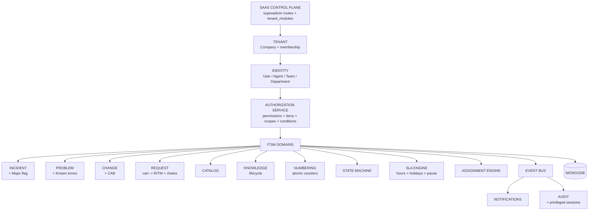

# PLATFORM 01 — ITSM / HELPDESK (single source of truth)

Status legend: `IMPLEMENTED` (code evidence below) · `PARTIAL` (works with known gaps) ·
`BACKEND_ONLY` · `FRONTEND_ONLY` · `MISSING`. Source of truth priority: executable
code > schema > API wiring > frontend > tests > this document.

Generated from the repository on 2026-09-09. Evidence paths are backend-relative
unless prefixed `FE:` (OsTicketFrontend).

---

## PART A — SaaS Platform Foundation

### A1. SaaS control plane
| Capability | Status | Evidence |
|---|---|---|
| Tenant lifecycle (create/read/update/activate/suspend/archive/restore/terminate) | IMPLEMENTED | `src/routes/superadmin.routes.js` (`/companies/*`), `src/controllers/superadmin/` |
| Plans, subscriptions, module entitlements, usage limits | IMPLEMENTED | `src/models/Plan.js`, `Entitlement.js`, `UsageLimit.js`, `tenant_modules` collection |
| Module activation/deactivation + trial/grace | IMPLEMENTED | `src/middleware/module.js` (`moduleRequired`, `activateModules`, grace read-only) |
| Module whitelist (21 keys incl. cmdb/secops/grc/workplace/legal/procurement/finance/esg/fsm) | IMPLEMENTED | `src/middleware/module.js` |
| SaaS operators, audit, operations/health, billing controls | PARTIAL | superadmin routes + `AuditLog.js`; per-operator permission scoping is coarse |
| Tenant data protected from SaaS operators by default | PARTIAL | boundary is conventional (separate tokens/planes); privileged access is session-based (see A3) but per-action dual-actor logging is not enforced in every controller |

### A2. SaaS roles & permissions
SaaS operator permissions are string grants on `SuperAdmin.permissions`, checked by
`requireSuperAdminPermission` (`src/middleware/auth.js`). Tenant roles use `Role`
(`src/models/Role.js`): `scope` platform|tenant with boundary validation,
`category`, `permissions[]` (30-key enum, see F2), `deniedPermissions[]` (explicit
DENY, no enum by design), `recordScopes[]`, `fieldAccess[]`, `moduleKeys[]`,
`approvalLimit`, `protected`, `assignableBy`.

### A3. Privileged access (MD §8)
| Capability | Status | Evidence |
|---|---|---|
| Impersonation requires reason, short-lived token (15m default, 60m max) | IMPLEMENTED | `src/controllers/superadmin/impersonation.js`, `POST /superadmin/impersonate` |
| Session record: sessionId, real/effective actor, tenant, reason, expiry, IP/UA, correlationId, termination | IMPLEMENTED | `src/models/PrivilegedSession.js` |
| Revocation enforced at auth time (`sid` claim check in `protectAgent`) | IMPLEMENTED | `src/middleware/auth.js` |
| Break-glass with self-approval flag, audit + operator notification | IMPLEMENTED | `POST /superadmin/break-glass` |
| Session list / revoke endpoints | IMPLEMENTED | `GET /superadmin/privileged-sessions`, `POST /superadmin/privileged-sessions/:id/revoke` |
| Per-action dual-actor (`realActorId` + `effectiveActorId`) stamping in ITSM writes | MISSING | session carries both actors; controllers do not stamp them yet |

---

## PART B — Tenant Administration & RBAC

### B1. Central authorization service (MD §26/§59/§85)
`src/services/authorization.service.js` — `authorize({principal, permission,
tenant, module, resource, record, requiredScope, conditions, fields, req})`.
Chain: authenticated → account active → tenant resolved → membership valid →
module entitlement → permission (DENY > direct > role > assignment > default deny)
→ scope gate → record conditions → advisory field filtering. Internal `reason`
codes are audited (`authz.denied`), never sent to clients; `assertPermission()`
throws generic 403. `requirePermission(perm, opts)` middleware delegates to it and
attaches `req.authz`. Legacy `hasPerm`/`isAdminAgent` (`agent.controller.js`) and
`rbac.effectiveAccess` delegate to the same precedence (incl. role DENY).

Scopes evaluated: `TENANT, OWN, ASSIGNED_TO_ME, TEAM, DEPARTMENT`
(+ legacy lowercase `recordScopes` mapping). Record conditions support
`=,!=,in,not_in` with `current_user/current_tenant` tokens.

### B2. RBAC gap register
| Capability | Status | Notes |
|---|---|---|
| Custom roles / custom permissions engine | MISSING | no CustomRole/CustomPermission models; tenant roles are admin-curated `Role` docs |
| Tenant permission-namespace (`tenant.*`, `itsm.*`) | MISSING | current keys are flat (`tickets.view`, …); rename is a migration |
| Permission simulation / "what can user X do" | MISSING | |
| Temporary roles / delegation approval workflow | PARTIAL | `platformSecurity/Delegation.js` (scopes/reason/expiry); no approval flow or engine hookup |
| Separation-of-duties rules | MISSING | `canGrant` blocks platform/protected + unheld-perm grants only |
| Frontend action/field gating | PARTIAL | route-level `ModuleGuard` + new per-action gates (escalations, CAB); no field-level gating |

---

## PART C — ITSM Modules (status vs evidence)

| ID | Module | Status | Backend evidence | Frontend evidence (`FE:helpdesk/pages/`) |
|---|---|---|---|---|
| ITSM-01 | Service Desk / tickets | PARTIAL | portal ticket endpoints require tenant Helpdesk entitlement; `ticket.routes.js`, `agent.routes.js` (reply/note/assign/claim/transfer/status/merge/split/tasks/SLA pause), `Ticket.js`; intake/read/comment/assignment integration suites | TicketList, NewTicket, TicketDetail (+tasks/SLA/closure), TicketBoard, TicketTemplates, TicketCrud, MyWork |
| ITSM-02 | Incident | PARTIAL | `Enterprise Incident.js` (Sev1-4, commander, timeline), `GET/POST/PUT /enterprise/incidents` with numbering + state machine | Incidents, IncidentCrud, IncidentDiagnosis, IncidentPlaybooks |
| ITSM-03 | Major incident | PARTIAL | dedicated major declaration, secured communication plan/send/read endpoints, durable communication records and idempotent cadence scheduler (`tests/itsm-major-incident-security.test.js`) | MajorIncidents, WarRoom, OutageTracking, OnCallSchedules |
| ITSM-04 | Problem | PARTIAL | `Problem.js` (RCA/workaround/known_error/permanentSolution, links), secured `GET/POST/PUT /enterprise/problems` with record auth, lifecycle evidence checks and mandatory audit (`tests/itsm-problem-security.test.js`) | Problems, ProblemCrud, KnownErrors |
| ITSM-05 | Change | PARTIAL | `Change.js`, secured `GET/POST/PUT /enterprise/changes` with record auth, window/type/risk validation, lifecycle evidence/audit; blackout windows and CAB status matrix (`tests/itsm-change-security.test.js`) | Changes, ChangeCrud, ChangeCalendarPage, CabBoard, PostImplReviews |
| ITSM-06/07 | Request / Catalog | PARTIAL | canonical tenant-scoped cart→REQ/RITM checkout/read/fulfillment with audit, secured bundles and eligibility (`tests/itsm-request-catalog-security.test.js`, `itsm-catalog*-security.test.js`) | Requests, ServiceCatalog |
| ITSM-08 | Knowledge | PARTIAL | `Faq.js` lifecycle (draft/review/approved/published/expired/archived) + `POST /agent/faqs/:id/transition`, gap analysis, publish-sweep | KnowledgeBase (lifecycle toolbar), KnowledgeInsights |
| ITSM-09 | SLA | PARTIAL | `SlaPlan.js` (targets, pause, per-plan businessHours/timezone), global hours+holidays engine; resolution/response breach scheduler is atomic, idempotent and audited (`tests/itsm-sla-scheduler-security.test.js`) | SlaMonitor, PriorityMatrixEditor, Settings/SLA |
| ITSM-10 | Assignment & routing | PARTIAL | next-agent engine (round-robin/skills/least-loaded), caps, assignment history, workload; tenant/permission/audit security suite (`tests/itsm-routing-security.test.js`) | AssignmentRouting, ShiftHandover |
| ITSM-11 | Tasks | PARTIAL | ticket task create/update are Helpdesk-module + `tickets.tasks` protected with scoped ticket lookup, validation and audit; closure codes, worklogs, trash/restore | in TicketDetail; HelpdeskAdmin (trash) |
| ITSM-12 | Approvals | PARTIAL | `Approval.js`, secured approval-chain create/decide with role activation and creator/decider separation (`tests/itsm-approval-security.test.js`) | Requests (chains), ApprovalInbox (settings), CabBoard (gated) |
| ITSM-13 | Escalations | IMPLEMENTED | `GET/POST/PUT/DELETE /agent/escalations` + `escalations.manage` enforcement | Escalations (permission-gated) |
| ITSM-14 | Comms & notifications | PARTIAL | threads, mentions extract, presence, email/chat/in-app, quiet hours service | in TicketDetail; NotificationPrefs (settings) |
| ITSM-15 | Workspace | PARTIAL | queues, saved queues, workload, canned | MyWork, TicketBoard |
| ITSM-16 | Self-service portal | PARTIAL | portal login/register, open-form, public catalog/chat/status/CSAT | CustomerServicePortal (CSM), NewTicket |
| ITSM-17 | Satisfaction | PARTIAL | `Survey.js`, `SurveyResponse.js`, authenticated CSAT submit/lookup; unsafe recovery sweep retired pending shared tasks | CsatDashboard |
| ITSM-18 | Reporting | PARTIAL | reports/overview, realtime, MTT metrics, exec major-incident report | HelpdeskReports, analytics/* |
| ITSM-19 | Administration | PARTIAL | help-topics, SLA plans, canned, announcements, filters, closure codes, custom statuses/forms/tables | HelpdeskAdmin, PriorityMatrixEditor, Settings/* |
| ITSM-20 | Audit & history | PARTIAL | `AuditEvent.js`/`AuditLog.js`, audit.service, `/enterprise/audit`, privileged session audit | AuditTrail, Settings/AuditLogs |

Cross-cutting engines: `numbering.service.js` (atomic per-tenant INC/PRB/CHG/REQ/RITM/TASK;
legacy tickets keep the unique random generator), `stateMachine.service.js`
(ticket/incident/problem/change/faq matrices, enforced in `changeStatus`,
enterprise PUTs, FAQ transitions), `authorization.service.js` (above).

---

## PART D — Backend Architecture

Layered flow: `routes/` → `middleware/auth.js` (authenticate) → `middleware/module.js`
(entitlement) → `requirePermission` (authorize) → `controllers/` →
`services/` (domain) → `models/` → MongoDB; side-effects via `services/events.js`
→ audit / notifications / SLA / search. Tenant isolation: `company` scoping +
`tenantScope` (`runWithTenant`) + `scopeTicketQuery` record scoping; mass
assignment removed from enterprise ITSM PUTs (whitelisted fields).

---

## PART E — Verification & Tests

| Test | Type | Covers |
|---|---|---|
| `tests/authorization.test.js` (26 asserts) | unit, no DB | gates, deny precedence, scopes, conditions, fields, modules, generic 403 |
| `tests/itsm-foundation.test.js` (25 asserts) | unit, no DB | numbering format, 5 state matrices, SLA calendar, role deny |
| `tests/itsm-incident-security.test.js` | integration | authenticated agent, permission deny, cross-tenant denial, validation, transition history and mandatory audits for Incident + legacy operational updates |
| `tests/itsm-major-incident-security.test.js` | integration | declaration governance, agent/permission/tenant denial, cadence validation, scheduler idempotency, durable communications and required audit events |
| `tests/itsm-problem-security.test.js` | integration | authenticated agent, permission deny, cross-tenant denial, known-error/fix/closure evidence and mandatory audits |
| `tests/itsm-change-security.test.js` | integration | authenticated agent, permission deny, cross-tenant denial, input/lifecycle evidence, operational timestamps and mandatory audits |
| `tests/itsm-request-catalog-security.test.js` | integration | authenticated catalog isolation, checkout input and tenant validation, requester scope, RITM fulfillment and required audit events |
| `tests/itsm-catalog-security.test.js`, `itsm-catalog-eligibility-security.test.js` | integration | catalog bundle/eligibility permissions, cross-tenant denial and audit coverage |
| `tests/itsm-approval-security.test.js` | integration | approval-chain creation/decision permissions, active approver role, tenant scope, separation of duties, validation, idempotency and audit events |
| `tests/itsm-ticket-portal-intake.test.js`, `itsm-ticket-read.test.js`, `itsm-ticket-comment.test.js`, `itsm-ticket-assign.test.js`, `itsm-ticket-actions-security.test.js` | integration | portal entitlement/intake validation and audit, requester/agent record scope, public/private thread separation, assignment and cross-tenant target denial; task/worklog/bulk validation, scoped SLA prediction, status/CSAT enumeration prevention |
| `tests/itsm-knowledge-security.test.js` | integration | agent-only KB boundary, `kb.manage` enforcement, tenant scope, lifecycle transition and audit events |
| `tests/itsm-sla-scheduler-security.test.js` | integration | tenant-scoped, atomic and idempotent response/resolution breach scheduler with required audit evidence |
| `tests/itsm-routing-security.test.js` | integration | route selection and capacity permissions, same-tenant candidate validation, cross-tenant denial, history and audit events |
| `tests/itsm-asset-security.test.js` | integration | asset create/read/update permissions, tenant and owner validation, record scope, allowlisted writes and audit events |
| `tests/itsm-workflow-security.test.js` | integration | workflow-management permission, tenant isolation, allowlisted update/tenant-overwrite resistance and audit evidence |
| `tests/tenant-isolation.test.js`, `platform-role-boundary`, `organization-hierarchy`, `itsm-ticket-*`, `helpdesk-agent-contract` | integration, needs Mongo | end-to-end (run against isolated DB, never shared Atlas) |

Negative-path evidence: authorization unit tests assert DENY for unauthenticated,
inactive, tenant-less, cross-tenant, permission-missing, scope-rejected and
condition-rejected cases. HTTP-level negative tests (403 + cross-tenant) exist in
the integration suite but require an isolated MongoDB to execute.

---

## PART F — Matrices (condensed; full row-level matrices are generated from code)

### F1. Role matrix (representative)
| Role | Layer | Scope source | Purpose | Status |
|---|---|---|---|---|
| SAAS_SUPER_ADMIN | SAAS | platform aggregate | platform ops, tenants, plans | PARTIAL (coarse per-operator perms) |
| Tenant Admin (`isAdmin`) | TENANT | `admin_aggregate` via authz service | full tenant access, audited | IMPLEMENTED |
| Agent (role-based) | TENANT | `Role.permissions` + `recordScopes` + `deniedPermissions` | scoped ITSM work | IMPLEMENTED |
| Requester/User | TENANT | own-record scoping | portal self-service | IMPLEMENTED |
| Custom roles | TENANT | — | tenant-defined | MISSING |

### F2. Permission matrix (from `Role.PERMISSIONS`, 30 keys)
`tickets.view/create/edit/assign/transfer/close/delete/reply/note/tasks`,
`users.manage`, `kb.manage`, `canned.manage`, `admin.manage`, `orgs.manage`,
`escalations.manage`, `organization.manage`, `organization.units.manage`,
`organization.locations.manage`, `access.manage`, `roles.manage`,
`modules.manage`, `billing.view/manage`, `workflow.manage`,
`integrations.manage`, `reports.manage`, `data.manage`, `audit.view`,
`approvals.decide`, `records.view/create/update/delete`, `exports.create`,
`security.manage` — all BACKEND-enforceable via the service; route wiring is
incremental (escalation writes enforced; ticket reads scoped; remainder open).
`itsm.*`/`tenant.*`/`saas.*` namespaced keys: MISSING (migration).

### F3. API → permission matrix (helpdesk surface)
| Method + Endpoint | Permission / gate | Status |
|---|---|---|
| `GET /agent/tickets`, `:number`, reply/note/assign/claim/transfer/tasks | module `helpdesk` + explicit ticket permission + record scoping (`scopeTicketQuery`/`loadTicketForAgent`) | PARTIAL (agent, requester and bulk reference paths wired; remaining commands need the same evidence) |
| `POST /agent/tickets/:n/status` | module + `tickets.close` for resolved/closed, otherwise `tickets.edit` + state machine | PARTIAL (transition-specific validation/audit hardening remains) |
| `POST/PUT/DELETE /agent/escalations` | `escalations.manage` via central service | IMPLEMENTED |
| `GET/POST/PUT /enterprise/incidents` | module + agent-only records.view/create/update + record scope + required audit | PARTIAL (core incident reference routes hardened; purpose-specific grants and remaining incident routes remain) |
| `GET/POST/PUT /enterprise/problems` | module + agent-only records.view/create/update + record scope + company isolation + required audit + lifecycle evidence | PARTIAL (core problem reference routes hardened and HTTP security suite passing; purpose-specific grants and related workflow routes remain) |
| `GET/POST/PUT /enterprise/changes` | module + agent-only `records.view/create/update` + record scope + company isolation + numbering + state machine + required audit | PARTIAL (core routes hardened and HTTP security suite passing; CAB/sub-task and related workflow routes remain) |
| `POST /agent/faqs/:id/transition` | `kb.manage` + faq matrix | IMPLEMENTED |
| `POST /superadmin/impersonate|break-glass`, session revoke | superadmin + reason + session TTL | IMPLEMENTED |
| `POST /enterprise/requests/cart`, `GET /enterprise/requests/:id`, RITM fulfill | module + requester/tenant scope + agent permission + validated catalog items + audit | PARTIAL (canonical checkout slice verified; fulfillment task chains, approval integration and frontend workflow remain) |
| `POST /gaps2/catalog/cart`, approval-chain decide | retired checkout (410); approval-chain work remains partial | PARTIAL |

### F4. Custom-permission matrix
| Capability | Status |
|---|---|
| create/edit/disable/delete custom permission, custom scope/condition/field | MISSING (engine does not exist) |
| role-level DENY, direct `!` DENY, precedence | IMPLEMENTED |
| temporary/delegated access with expiry | PARTIAL (Delegation model only) |

---

## PART G — Roadmap (next dependencies in order)

1. Per-action `requirePermission` rollout: tickets (view→`tickets.view`, assign→`tickets.assign`, close→`tickets.close`, …), incidents/problems/changes — each with authorized + unauthorized + cross-tenant HTTP tests on isolated Mongo.
2. Custom roles/permissions engine (tenant namespace, escalation guards, simulation).
3. Per-action dual-actor stamping for privileged sessions in ITSM writes.
4. `itsm.*`/`tenant.*`/`saas.*` permission rename migration.
5. Request fulfilment-task chain + change/problem task sub-entities in UI.
6. Calendar-aware breach evaluation wired into OLA radar + scheduled SLA job evidence.
7. Survey trigger/template engine (on-close CSAT).
8. Mobile (`GaliocasNetwork`) parity for workspace/CAB/SLA/escalation flows.
9. Full row-level matrices (role×permission, feature hierarchy) extracted from verified code.

Acceptance for any item: authorized 200 + unauthorized 403 + cross-tenant 403/404 +
audit event + docs row updated here. Platform 01 is complete only when every P0/P1
row above reads IMPLEMENTED with test evidence.

---

## PART H — Full section-wise completion audit

This section is the delivery checklist, not a screen inventory. A page or endpoint
is not considered complete unless its writes are validated, permission checked,
record scoped, tenant isolated, audited, tested on negative paths, and manually
verified. Current production-complete coverage is approximately **10%**; another
**35–40%** is functional but partial; approximately **55–65%** remains.

### ITSM-01 — Service Desk / ticket management — PARTIAL

- [x] **Present:** portal and agent creation, lists and detail, public/user replies,
internal notes, assignment/claim/transfer, status transitions, merge/split, links,
collaborators, locks, tasks, SLA pause/resume, closure codes, attachments, queues,
saved views and board/list UIs.
- [x] Agent SLA prediction collection/detail endpoints now require `tickets.view`
  and use the same ticket-record scope as the workspace. Semantic search on the
  Helpdesk route is restricted to scoped ticket results until each additional
  entity has its own permission and record-scope policy. The predictor uses
  actual `resolutionDueAt`/`dueDate` clocks rather than the nonexistent
  `slaDueAt` field. `tests/itsm-ticket-actions-security.test.js` verifies
  allowed scoped results and rejects an out-of-scope detail prediction.

**Missing to complete:**

- [ ] Apply `tickets.view/create/edit/assign/transfer/close/delete/reply/note/tasks`
  to every matching `/agent/tickets*`, `/tickets*`, bulk and export route.
- [ ] Apply the same record-scope policy to reads and every mutation (own, assigned,
  team, department, tenant); never rely only on the ticket number plus tenant.
- [x] Requester ticket operations are ownership-scoped and use explicit user
  permissions (`view`, `create`, `reply`, `delete`); merge is not exposed on
  the requester router. The requester router now also requires the active
  Helpdesk module. `tests/itsm-ticket-portal-intake.test.js` covers anonymous
  denial, tenant/topic isolation, disabled-module denial, validation, creation
  and audit evidence; `tests/itsm-ticket-actions-security.test.js` covers
  requester ownership, close/reopen and merge denial.
- [ ] Validate transition-specific required fields, attachment limits/types, merge
  compatibility, duplicate collaborators, lock ownership and concurrency.
- [ ] Guarantee immutable audit events for every content edit, delete, merge/split,
  field change, assignment, SLA action and state transition.
- [ ] Add HTTP tests for every action: allowed, missing permission, explicit DENY,
  wrong record scope, cross-tenant ID/number, inactive account, disabled module,
  validation failure and concurrent update.
- [ ] Add frontend action/field gates and consistent 403/404, validation, retry,
  empty, loading and conflict states; manually verify agent and requester flows.

### ITSM-02 — Incident management — PARTIAL

- [x] **Present:** numbered incidents, severity, commander, team/services, timeline,
state-machine updates, incident screens, diagnosis/playbook surfaces and links to
assets/problems.
- [x] Core list/create/update/swarm APIs now require the active Helpdesk module,
  agent authentication and central records.view/create/update authorization; the
  list and mutations apply tenant plus role record-scope checks.
- [x] Core create/update/swarm actions emit required audit evidence. Verified with
  tests/itsm-incident-security.test.js: anonymous and permission-denied
  requests, authorized create/update, cross-tenant denial and audit evidence.
- [x] The Incidents workspace now gates create/resolve controls by records.create
  and records.update and presents permission/load failures. The frontend
  production build passes.
- [x] Core incident mutation now rejects invalid severity/service input, requires
  a resolution before the `resolved` transition, and writes durable timeline and
  status-update entries for state transitions. The incident security suite
  verifies these validation and transition-evidence paths.
- [x] The legacy stakeholder-update and resolution-team actions now use the
  canonical company tenant key, active Helpdesk entitlement, agent permissions,
  record authorization, validation and required audit events. Resolution teams
  persist as same-tenant active agents; the incident security suite verifies
  anonymous, permission-denied, cross-tenant and invalid-reference rejection.
- [x] War Room now hides stakeholder and resolution-team controls unless the
  principal has `records.update`, and displays server authorization failures.
  Known Errors likewise gates KB publishing with `kb.manage` and displays its
  server rejection. The production frontend build passes.

**Missing to complete:**

- [ ] Introduce purpose-specific incident permissions (view, create, update, assign,
  resolve, close, reopen, declare-major and communicate) on every incident route;
  the current hardened reference paths use generic records.* grants.
- [ ] Enforce record scopes on every remaining collection, detail, diagnosis, swarm,
  conversion and related-record endpoint; stakeholder-update and resolution-team
  are now covered by the reference record check.
- [ ] Complete triage, categorization, impact/urgency priority calculation,
  assignment, acknowledgment, investigation, resolution validation, closure and
  reopen flows with required data at each transition.
- [ ] Persist a consistent activity timeline and audit entry for every transition and
  relationship change, including real/effective actor during privileged access.
- [ ] Add full incident-specific API and UI negative-path tests and manual role tests.

### ITSM-03 — Major incident management — PARTIAL

- [x] **Present:** `isMajor`, commander, war-room/swarm UI, communication-plan storage,
communication-due check, outage tracking, stakeholder update and executive report.
- [x] Canonical major declaration/demotion, communication-plan and immutable
  communication APIs now enforce the Helpdesk module, agent records.update/view,
  tenant plus record scope, declaration/cadence/audience validation, and required
  audit evidence. tests/itsm-major-incident-security.test.js verifies anonymous
  and permission denial, cross-tenant denial, validation and durable evidence.
- [x] The Major Incidents workspace now uses the canonical declaration and
  communication-plan APIs, collects a declaration reason, gates stateful actions
  by records.create/update, and displays load failures. The frontend production
  build passes.
- [x] The major-incident communication scheduler atomically claims an overdue
  cadence plan, advances its next deadline, notifies the commander and writes a
  required system audit event. `tests/itsm-major-incident-security.test.js`
  verifies a due plan is processed exactly once with durable audit evidence.

**Missing to complete:**

- [ ] Add declaration criteria, role-restricted declaration/demotion, deputy roles,
  responder roster, acknowledgments and escalation tree.
- [ ] Complete audience templates, delivery status, retries and multi-channel updates;
  the cadence scheduler currently creates a command notification/audit event,
  while immutable sent communications are recorded by the canonical send API.
- [ ] Complete war-room bridge/chat integration, action/decision log, service/status
  page synchronization, timeline normalization and post-incident handoff.
- [ ] Require PIR/RCA ownership and due dates before final closure; link follow-up
  problem/change/tasks and track them to completion.
- [ ] Permission-, scope-, tenant-, audit- and failure-test every major-incident action.

### ITSM-04 — Problem and known-error management — PARTIAL

- [x] **Present:** numbered problems, RCA/workaround/permanent solution fields, known
error flag, incident/change/ticket links, KB publishing and change generation.
- [x] Core list/create/update APIs now require the Helpdesk module, agent-only
  records.view/create/update authorization, tenant plus record scope, and
  required audit events. tests/itsm-problem-security.test.js verifies
  anonymous/permission denial, authorized mutation, cross-tenant denial and
  audit evidence.
- [x] The Problems workspace gates creation by records.create and displays
  permission/load failures. The frontend production build passes.
- [x] Canonical problem updates now validate same-tenant incident/change/ticket
  links, active assignees and duplicate references. Known-error, fixed and
  closure transitions require their respective evidence (RCA/workaround,
  permanent solution, postmortem). The problem security suite verifies lifecycle
  validation and durable audit evidence for known-error publication.

**Missing to complete:**

- [ ] Add purpose-specific problem permissions (view/create/update/assign/investigate/
  publish-known-error/resolve/close) and record scopes to every route; the
  current core reference paths use generic records.* grants.
- [ ] Implement structured RCA methods, investigation tasks, cause/version history,
  workaround approval, known-error lifecycle and affected CI/service analysis.
- [ ] Make incident-to-problem and problem-to-change linking transactional/idempotent;
  prevent cross-tenant and unauthorized relationship creation.
- [ ] Add remediation ownership, due dates, effectiveness review, recurrence metrics,
  closure requirements, audit coverage and end-to-end negative tests.

### ITSM-05 — Change enablement / CAB — PARTIAL

- [x] **Present:** numbered changes, standard/normal/emergency type, risk, plans,
implementation windows, conflict/blackout checks, state machine, CAB UI, decision
surface, calendar and post-implementation-review screens.
- [x] Core list/create/update/conflict APIs now require the Helpdesk module,
  agent-only records.view/create/update authorization, tenant plus record scope,
  valid scheduled windows and required audit evidence. tests/itsm-change-security.test.js
  verifies anonymous/permission denial, validation failure, authorized mutation,
  cross-tenant denial and audit evidence.
- [x] The Changes workspace gates creation/conflict checks by records.create/view
  and displays permission/load failures. The frontend production build passes.
- [x] Canonical changes now reject invalid types/risks and cross-tenant or duplicate
  asset/ticket references. Scheduling requires a valid window plus implementation
  and rollback plans; implementation/validation/closure stamp operational evidence,
  while rollback/rejection/closure enforce their required fields. The change
  security suite verifies the complete core transition chain and persisted actor/timestamps.

**Missing to complete:**

- [ ] Add purpose-specific change permissions for read, submit, assess, schedule,
  approve, reject, implement, validate, close, cancel and emergency
  authorization; the current core reference paths use generic records.* grants.
- [ ] Prevent requesters from approving their own changes through explicit
  separation-of-duties policy; validate approver authority, quorum, groups,
  delegation expiry, approval limits and sequential/parallel decisions.
- [ ] Make risk assessment policy-driven; distinguish advisory conflicts from hard
  blocks and require authorized override with reason and audit.
- [ ] Complete implementation tasks/checklists, test evidence, rollback execution,
  change freeze governance, actual start/end, failed-change handling and PIR.
- [ ] Add optimistic concurrency/idempotency, notification/escalation timers,
  complete audit history and full authorized/unauthorized/cross-tenant tests.

### ITSM-06 — Service request management — PARTIAL

- [x] **Present:** parent request and RITM creation from cart, requester/fulfilled-for,
request screens and approval-chain linkage.
- [x] Canonical checkout now requires authentication and the Helpdesk module,
  validates each active portal-visible catalog item and requester/fulfilled-for
  tenant boundary, creates a REQ parent plus tenant RITMs, and requires audit
  evidence. tests/itsm-request-catalog-security.test.js verifies anonymous,
  catalog/fulfilled-for cross-tenant, quantity validation and successful audited
  checkout. The Requests UI now uses this canonical endpoint; frontend build passes.
- [x] Canonical REQ list/detail routes now enforce requester/fulfilled-for ownership
  or agent `records.view` plus tenant record scope. Tenant-scoped agents can fulfill
  an in-progress RITM, which completes the parent REQ only after all of its RITMs
  are fulfilled; both records have required audit evidence. The request
  security suite verifies owner read, cross-tenant denial, fulfillment and parent completion.

**Missing to complete:**

- [ ] Add request permissions and requester/fulfilled-for/fulfiller record scopes.
- [ ] Implement REQ → RITM → fulfillment-task chains, dependencies, parallel work,
  assignment groups, due dates, SLAs/OLAs, evidence, cancellation and rollback.
- [ ] Enforce approval completion before fulfillment and prevent requester/self-
  approval where policy forbids it.
- [ ] Provide requester-visible status, comments, attachments, fulfillment progress,
  delivery confirmation and reopen/return handling.
- [ ] Audit and test every state, task and approval transition including partial cart
  failure, retries, idempotency, quota race and cross-tenant catalog IDs.

### ITSM-07 — Service catalog — PARTIAL

- [x] **Present:** public/tenant catalog browsing, items, bundles, basic eligibility,
forms, cart checkout and per-user quota checks.
- [x] Checkout no longer trusts client-provided catalog metadata: it resolves only
  active, portal-visible items in the active tenant and validates quantities server-side.
- [x] Legacy catalog bundle and eligibility administration now has explicit
  Helpdesk agent actions, tenant-bound catalog-item validation, bounded input,
  audit evidence and a secured bundle update/delete path. The verified
  `tests/itsm-catalog-security.test.js` and
  `tests/itsm-catalog-eligibility-security.test.js` suites cover anonymous,
  denied, cross-tenant and allowed management cases, including eligibility
  update/delete audit evidence.
- [x] Public catalog browsing no longer falls back to an arbitrary tenant: it
  requires a verified tenant context and returns only that tenant's active,
  portal-visible catalog. The request/catalog security suite verifies anonymous
  rejection and tenant-isolated browsing.
- [x] The unvalidated legacy `/gaps2/catalog/cart` write path is retired with a
  `410`; `/enterprise/requests/cart` is the sole canonical, audited checkout path.

**Missing to complete:**

- [ ] Add separate catalog administration, publish and order permissions; enforce
  audience/eligibility rules server-side for browse, item detail and checkout.
- [ ] Complete versioned item lifecycle, categories, localized content, pricing/cost,
  variables, conditional forms, validation, attachments and fulfillment plans.
- [ ] Make cart checkout atomic and idempotent across REQ/RITMs/approvals/tasks; define
  compensation if one child fails.
- [ ] Implement quantity, inventory/vendor/procurement integration, recurring items,
  lead-time promises and entitlement consumption.
- [ ] Add admin/requester UI gating, form accessibility and exhaustive eligibility,
  quota, tampering, cross-tenant and concurrency tests.

### ITSM-08 — Knowledge management — PARTIAL

- [x] **Present:** FAQ/category CRUD, draft→review→approved→published→expired→archived
lifecycle, suggestions, deflection metrics, gap analysis and publish sweep.
- [x] FAQ/category management now requires the Helpdesk module and kb.manage on
  every route. New articles are drafts, lifecycle transitions update the declared
  lifecycle field, and create/update/delete/transition actions have required audit
  evidence. tests/itsm-knowledge-security.test.js verifies anonymous, denied and
  cross-tenant writes, draft creation, transition persistence and audit evidence.
- [x] KnowledgeBase now loads the managed API for authorized editors, uses lifecycle
  rather than a stale status field, gates transitions and displays load failures.
  The frontend production build passes.

**Missing to complete:**

- [ ] Replace the current coarse kb.manage control with finer
  create/review/approve/publish/retire permissions and separation-of-duties.
- [ ] Add article ownership and audience scopes, version/diff/rollback, attachments,
  localization, review dates, expiry ownership and duplicate detection.
- [ ] Separate author and approver where required; add feedback moderation, verified
  resolution linkage, search quality and broken/stale article workflows.
- [ ] Audit content and lifecycle changes and add unauthorized, DENY, scope,
  cross-tenant, stale-version and transition tests plus frontend field gating.

### ITSM-09 — SLA / OLA management — PARTIAL

- [x] **Present:** SLA plans/targets, pause and resume, business hours, holidays,
timezones, due-date recompute/history, monitor UI, priority matrix and breach radar.
- [x] The resolution and first-response schedulers now atomically claim each breach
  before side effects, write required tenant-scoped system audit evidence, and roll
  the claimed state back if that evidence cannot be stored. The verified
  tests/itsm-sla-scheduler-security.test.js regression suite covers repeat-run
  idempotency, durable breach state and tenant-separated audit records.
- [x] Atomic SLA breach claims re-check the active, unpaused ticket and due clock at
  write time, so a concurrent close, pause or reschedule cannot produce a false
  breach after candidate enumeration.

**Missing to complete:**

- [ ] Complete deterministic SLA selection/precedence and snapshot the applied policy
  so later plan edits do not rewrite historical commitments.
- [ ] Add leader election or idempotent leases, retries, recovery and observable job
  health around the scheduled breach evaluation.
- [ ] Complete pause-condition accounting, calendars/DST, reopen/reassignment rules,
  multiple response/resolution targets and OLA/underpinning-contract propagation.
- [ ] Trigger escalations/notifications/workflows exactly once and audit every clock
  event; expose explanations for calculated deadlines.
- [ ] Add fake-clock tests across holidays, DST, pauses, plan changes, job retries and
  tenant isolation, plus an operational runbook and manual breach verification.

### ITSM-10 — Assignment, routing and queues — PARTIAL

- [x] **Present:** assign, claim and transfer, round-robin/skills/least-loaded routing,
capacity, workload, assignment history, queues and shift handover UI.
- [x] The legacy next-agent selection and assignment-history paths now require an
  active Helpdesk agent with `tickets.assign`, validate ticket tenant and record
  scope, select only active same-tenant agents, use an atomic tenant-specific
  round-robin cursor, and write tenant-scoped history plus mandatory audit evidence.
  Capacity controls use the same guard, validate active same-tenant agents and
  bounded values, and are auditable. `tests/itsm-routing-security.test.js`
  verifies anonymous, denied, cross-tenant and allowed behavior.
- [x] The Assignment & Routing page gates suggestion/history controls on
  `tickets.assign` and renders permission/load failures. The frontend production
  build passes.

**Missing to complete:**

- [ ] Permission-check manual/bulk/automatic assignment and ensure assignee/team/
  department belongs to the same tenant and is eligible/active.
- [ ] Define routing rule priority, tie-breaking, fallback, schedules, out-of-office,
  skills proficiency, capacity reservation and no-agent handling.
- [ ] Enforce queue visibility with record scopes and filter sensitive fields.
- [ ] Make routing concurrency-safe and idempotent; audit decision inputs, selected
  rule, override reason and transfers.
- [ ] Add deterministic tests for rules, caps, races, fallback and cross-tenant IDs;
  complete admin simulation and manual queue verification.

### ITSM-11 — Task and worklog management — PARTIAL

- [x] **Present:** ticket task create/update, closure codes, worklogs and trash/restore
surfaces.
- [x] Ticket worklog read/create now requires a Helpdesk agent, explicit ticket
  action permission and ticket record scope; new entries have bounded minutes and
  a required note, and create events are audited. The ticket-action security suite
  verifies requester denial, wrong-scope denial, allowed creation and audit evidence.

**Missing to complete:**

- [ ] Create a common task entity/service usable by ticket, problem, change, request,
  incident and major-incident workflows, with parent/child dependencies.
- [ ] Add task CRUD/assign/complete permissions, record scopes, state machine,
  required completion evidence, due dates, OLA, watchers and notifications.
- [ ] Prevent parent completion when mandatory tasks remain open; support cancellation
  propagation and safe reassignment.
- [ ] Audit all worklog/task changes; add time-entry edit/approval policy and tests for
  authorization, tenant isolation, dependencies and concurrency.

### ITSM-12 — Approvals — PARTIAL

- [x] **Present:** approval documents, chained steps, decision endpoints, my-approvals
surface and CAB decision UI gating.
- [x] The legacy approval-chain decision command now requires an active Helpdesk
  agent with `approvals.decide`, verifies the current pending step is assigned to
  the caller's role, validates the decision, rejects completed-chain replays and
  writes required tenant-scoped audit evidence. Chain create/list now require
  `approvals.manage`, validate tenant-bound entity/step input and audit creation.
  `tests/itsm-approval-security.test.js` verifies anonymous, denied, wrong-role,
  cross-tenant, invalid and double-submit cases.
- [x] The Requests page hides approval-chain data unless `approvals.manage` is
  granted, gates decision controls on `approvals.decide`, and displays server
  rejection/load errors. The frontend production build passes.
- [x] Approval chains now stamp their creating agent and deny that creator from
  deciding the chain, even when the creator otherwise holds the approver role.
  The approval security suite verifies the separation-of-duties denial.

**Missing to complete:**

- [ ] Enforce `approvals.decide` on every decision endpoint server-side and verify the
  authenticated principal is the active approver/delegate for the current step.
- [ ] Implement sequential/parallel groups, quorum, reject behavior, rework, recall,
  expiry, reminders, escalation, cancellation and immutable decision history.
- [ ] Add separation-of-duties, self-approval rules, approval limits, temporary
  delegation approval/revocation and snapshot approver resolution.
- [ ] Make decisions atomic/idempotent and bind them to the correct tenant and source
  record; audit real/effective actor, reason and before/after state.
- [ ] Add tamper, double-submit, stale-step, wrong-approver, expired delegation and
  cross-tenant tests plus frontend disabled/error states.

### ITSM-13 — Escalation management — IMPLEMENTED (narrow scope)

- [x] **Present:** list/create/update/delete escalation management, central
`escalations.manage` enforcement on writes, tenant scoping and permission-gated UI.

**Remaining hardening (does not expand the current capability):**

- [ ] Add explicit read permission/record visibility if escalation policies are not
  intended for every authenticated tenant principal.
- [x] Escalation create/update/delete commands now write required tenant-scoped
  before/after audit events.
- [ ] Maintain HTTP-level allow/deny/DENY/cross-tenant tests, optimistic concurrency
  and destructive-action confirmation.
- [ ] When automatic escalation execution becomes part of this area, add durable
  scheduling, exactly-once notification behavior, retries and job observability.

### ITSM-14 — Communications and notifications — PARTIAL

- [x] **Present:** ticket threads, public/internal messages, mentions extraction,
presence, email/chat/in-app channels, preferences and quiet-hours service.
- [x] Canonical enterprise call-log create/update/link paths now require explicit
  Helpdesk agent actions, validate tenant ticket/user/agent references and call
  values, and produce mandatory audit evidence. `tests/itsm-call-security.test.js`
  verifies anonymous, denied, cross-tenant and invalid-input paths.

**Missing to complete:**

- [ ] Centralize event templates, audience resolution, localization, branding,
  channel fallback, preference/legal overrides and sensitive-data redaction.
- [ ] Add durable outbox/queue processing, idempotency, retry/backoff, dead-letter
  handling, delivery/bounce status and operational dashboards.
- [ ] Permission/scope-check thread edits/deletes, mentions, broadcasts, stakeholder
  and status-page communications; secure inbound email identity and threading.
- [ ] Preserve immutable communication audit history and test duplicate delivery,
  failures, quiet hours, cross-tenant recipients and privilege boundaries.

### ITSM-15 — Agent workspace — PARTIAL

- [x] **Present:** dashboard, My Work, queues, saved queues, board, workload, canned
responses, search, ticket detail actions and shift handover.

**Missing to complete:**

- [ ] Make every count/card/list/detail derive from the same permission and record-
  scope policy; prevent aggregate and search-result data leakage.
- [ ] Add configurable personas/layouts, consistent keyboard/accessibility behavior,
  bulk-action permission previews, optimistic updates and conflict recovery.
- [ ] Complete real-time refresh/reconnect, notification inbox behavior, deep links,
  draft recovery and responsive/mobile parity.
- [ ] Add UI role matrix and end-to-end tests for hidden/disabled actions, 403/404,
  empty/error/loading, stale records, tenant switching and session expiry.

### ITSM-16 — Self-service portal — PARTIAL

- [x] **Present:** portal registration/login, ticket form, user ticket list/detail,
replies, public catalog/chat/status and CSAT endpoints.
- [x] CSAT ticket lookup now requires authentication and enforces requester ownership
  or agent ticket record scope; anonymous and same-tenant ticket-number enumeration
  are denied by the verified ticket-action security suite.

**Missing to complete:**

- [ ] Lock every user route to own/requested-for records with explicit rules for
  collaborators and organization visibility; restrict operational ticket actions.
- [ ] Complete verified registration/invitation, account recovery, MFA policy,
  anti-enumeration, rate limiting, CAPTCHA/abuse controls and secure uploads.
- [ ] Provide request/case history, knowledge-first deflection, approvals, delivery
  tracking, accessible/mobile UX, localization and notification preferences.
- [ ] Add adversarial IDOR/cross-tenant tests, authentication/session tests and manual
  requester-versus-agent verification.

### ITSM-17 — Satisfaction / CSAT — PARTIAL

- [x] **Present:** survey and response models, authenticated lookup/submit, and a CSAT
  dashboard. The unsafe negative-feedback recovery sweep is retired pending the shared
  task workflow.
- [x] Survey lookup no longer exposes ticket status/configuration based solely on a
  guessable ticket number; it is authenticated and ownership/record-scope checked.
- [x] CSAT submission now requires the signed-in ticket owner, verifies the tenant
  of the requested survey, and rejects anonymous or same-tenant IDOR attempts.
- [x] The legacy recovery-sweep endpoint now returns `410 Gone`; it cannot create
  malformed or unscoped follow-up records while the shared task workflow is incomplete.

**Missing to complete:**

- [ ] Trigger a versioned survey exactly once from eligible closure events with secure,
  expiring, single-use tokens and configurable delay/reminders.
- [ ] Validate tenant/ticket/respondent association without exposing ticket data;
  prevent replay, guessing, spam and response mutation.
- [ ] Add CSAT/NPS/CES templates, localization, anonymity/consent/retention controls,
  segmentation and auditable recovery ownership/workflow.
- [ ] Test trigger, expiry, replay, cross-tenant access, reopen/cancel cases and
  notification failure; manually verify the complete customer journey.

### ITSM-18 — Reporting and analytics — PARTIAL

- [x] **Present:** overview/realtime endpoints, ticket and MTT metrics, SLA/CSAT views,
audit view, helpdesk reports and major-incident executive report.
- [x] Canonical enterprise overview/realtime/report routes now require an active
  Helpdesk agent with `reports.manage`; the tenant audit feed requires `audit.view`.

**Missing to complete:**

- [ ] Apply report/export permissions, tenant and record scopes to source queries,
  aggregates, drilldowns, search, saved reports and exports.
- [ ] Define metric semantics, timezone/calendar behavior, exclusions and reconciliation
  against source records; version report definitions.
- [ ] Add scheduled reports, subscriptions, dashboards, filters, drilldown, export
  limits, masking and large-dataset async execution.
- [ ] Test inference/leakage through counts, cross-tenant filters, restricted records,
  formula correctness and performance; add freshness and failure monitoring.

### ITSM-19 — ITSM administration (including Asset/CMDB controls) — PARTIAL

- [x] **Present:** help topics, SLA plans, canned responses, announcements, filters,
statuses, forms/tables, asset CRUD, CI/service CRUD, relationships, impact/health,
model catalog, reconciliation, snapshots/diffs, attestation and lifecycle helpers.
- [x] The canonical `/enterprise/assets` read/create/update paths now require an
  agent, active Helpdesk entitlement and per-action record permission; they use
  scoped reads, tenant-validated owner/organization references, field allowlists
  and mandatory audit events. `tests/itsm-asset-security.test.js` verifies
  unauthenticated, denied, cross-tenant and allowed cases.
- [x] The shared `/enterprise` CRUD factory now applies agent-only Helpdesk
  entitlement, explicit `records.*` actions, tenant rebinding on update,
  record-scope filtering for collections, record authorization for mutations and
  required audit events. It is a P0
  baseline increment, not a substitute for entity-specific field allowlists,
  reference validation and record scopes. `tests/enterprise-crud-security.test.js`
  verifies anonymous/denied/cross-tenant behavior, tenant overwrite resistance and
  required audit evidence on the CMDB CI representative.
- [x] CMDB health, recomputation, CI relationship and impact-analysis actions now
  have explicit agent/action gates; relationship targets and graph traversal are
  tenant bounded, and recomputes/relationship writes have required audit evidence.
  `tests/enterprise-crud-security.test.js` verifies allowed, anonymous, denied and
  cross-tenant paths.
- [x] The CMDB CI reference slice now rejects unknown and tenant-controlled fields,
  relationship mass assignment and cross-tenant owners; supported command fields are
  allowlisted and owner references are tenant validated.

**Missing to complete:**

- [ ] Enforce distinct admin and Asset/CMDB permissions on every route; `/enterprise`,
  `/ops`, `/gaps2` and `/gaps3` currently contain broad tenant-login-only surfaces.
- [ ] Complete asset lifecycle from request/procure/receive/stock/assign/transfer/repair/
  audit/return/dispose, with custody, financial, warranty and disposal evidence.
- [ ] Complete CMDB class/schema governance, identification/reconciliation rules,
  source precedence, relationship constraints, discovery/import, certification,
  staleness, duplicate merge rollback and service mapping.
- [ ] Validate all references as same-tenant; add record scopes, field-level controls,
  masking, bulk-import validation, change history and immutable audit.
- [ ] Add complete route inventory and CRUD/action negative tests, data-quality tests,
  reconciliation concurrency tests and manual admin-versus-requester verification.

### ITSM-20 — Audit, history and compliance evidence — PARTIAL

- [x] **Present:** `AuditEvent`/`AuditLog`, audit service, tenant audit endpoint,
authorization-denial events and privileged-session audit records.

**Missing to complete:**

- [ ] Route all writes and workflow transitions through one mandatory audited command
  boundary; direct model writes must not silently bypass it.
- [ ] Store tenant, correlation/request ID, action, resource, before/after or safe diff,
  outcome, source, IP/UA, reason, and both real/effective actors.
- [ ] Make logs tamper-evident/append-only with retention, legal hold, export, access
  controls, masking and alerting for gaps or ingestion failure.
- [ ] Define failure semantics so business writes cannot claim success while mandatory
  audit evidence is lost; monitor coverage and delivery lag.
- [ ] Add tests asserting one correct audit event for every successful/failed sensitive
  command, no secret leakage, tenant isolation and privileged dual-actor stamping.

---

## PART I — Cross-cutting missing controls

### I1. Authorization and record scope — P0

- [x] Create a route-to-permission registry and fail CI when a protected business route
  lacks an explicit permission declaration.
- [x] Replace broad tenant-login-only operational access with default-deny action
  permissions on `/agent`, `/enterprise`, `/ops`, `/gaps2`, `/gaps3`, bulk,
  report/export and administrator routes.
- [ ] Standardize record-scope filters for every entity and use the same policy for
  collection, detail, mutation, relationship, aggregate, search and export paths.
- [ ] Add namespaced permission keys, custom permission definitions, custom tenant
  roles, explicit DENY, field access, conditions and safe migrations.
- [ ] Add permission simulation/explanation for administrators without leaking internal
  denial details to ordinary callers.

### I2. Governance and privileged access — P0/P1

- [x] Implement separation-of-duties rules for grants, CAB, request approvals, privileged access and financial/asset actions.
  privileged access and financial/asset actions.
- [ ] Connect temporary delegation to authorization, approval, expiry and revocation.
- [ ] Stamp real/effective actor on every privileged read/write and expose complete
  session/action evidence to authorized auditors.
- [ ] Add emergency-access review, alerting and post-use certification.

### I3. Data integrity and API safety — P0

- [ ] Validate input with explicit schemas and reject unknown fields consistently.
- [ ] Enforce same-tenant foreign keys/references in services, not only query filters.
- [ ] Add idempotency and transactions/compensation to multi-record workflows.
- [ ] Add optimistic concurrency for high-contention state and decision endpoints.
- [ ] Normalize errors so authentication/authorization/record existence do not leak
  sensitive information; apply pagination and bounded queries everywhere.

### I4. Audit, events and background processing — P0/P1

- [ ] Adopt an audited command/outbox pattern for writes plus notifications and jobs.
- [ ] Inventory scheduled work (SLA, approvals, CSAT, KB expiry, escalations), then add
  durable leases, retries, dead-letter handling, idempotency and health metrics.
- [ ] Define event schemas/versioning and trace workflows with correlation IDs.

### I5. Frontend completeness — P1

- [ ] Build a central permission/record/field-gating layer fed by effective access;
  hiding a button remains UX only, never the security boundary.
- [ ] Standardize loading, empty, validation, forbidden, not-found, offline, retry,
  conflict and partial-failure states on every ITSM page.
- [ ] Add accessibility, responsive behavior, localization, timezone formatting and
  unsaved-change protection; remove placeholder/demo-only interactions.
- [ ] Verify every page calls a real, authorized API and shows server rejection safely.

### I6. Test and release evidence — P0/P1

- [ ] Run integration tests only against an isolated disposable MongoDB; make this a
  required CI job with migrations/index creation and deterministic seed personas.
- [ ] For every endpoint test: allowed, unauthenticated, inactive, permission missing,
  explicit DENY, wrong scope, cross-tenant, invalid input, stale/concurrent update,
  disabled module and correct audit event.
- [ ] Add browser E2E journeys for requester, agent, manager, approver, tenant admin,
  auditor and privileged SaaS operator; include accessibility and visual checks.
- [ ] Add performance/load, queue/job recovery, backup/restore and security tests.
- [ ] Store manual verification evidence (tester, date, build, role, tenant, steps,
  result and screenshots) before changing any row to `IMPLEMENTED`.

---

## PART J — Definition of done and recommended execution order

An ITSM checklist item may be marked `IMPLEMENTED` only when all of these are true:

- [ ] Backend workflow and validation are complete, including failure and concurrency
   behavior.
- [ ] Every route has module, action-permission, tenant and record-scope enforcement.
- [ ] Every write and sensitive denial produces the required audit evidence, including
   real/effective actors for privileged access.
- [ ] Frontend actions and fields respect effective access and all operational states
   are usable.
- [ ] Automated tests prove allowed, denied, scoped and cross-tenant behavior against
   an isolated database.
- [ ] Manual verification is recorded for each supported role and end-to-end journey.
- [ ] Operational concerns—metrics, alerts, retries, runbook, migration and rollback—
   are documented and verified where applicable.

Recommended delivery sequence:

- [ ] **P0 security baseline:** route inventory, per-action permissions, record scopes,
   same-tenant reference validation and mandatory audit boundary.
- [ ] **Ticket vertical slice:** finish ITSM-01 end-to-end and use it as the reference
   pattern for tests, frontend gates and manual evidence.
- [ ] **Core ITIL chain:** Incident → Major Incident → Problem → Change, including
   approvals, tasks, communications and PIR.
- [ ] **Request chain:** Catalog → Request/RITM → Approval → fulfillment tasks → SLA →
   delivery/closure → CSAT.
- [ ] **Operations/data:** Asset/CMDB lifecycle, routing, durable SLA/OLA jobs,
   notifications and reporting.
- [ ] **Governance and hardening:** custom roles/permissions, simulation, delegation,
   separation of duties, dual-actor audit, performance, recovery and release proof.

Do not work screen-first across all modules. Complete one vertical checklist item
through backend, frontend, authorization, isolation, audit, automated tests and
manual evidence before starting the next item.

---

## PART K — Verified implementation log

### 2026-09-09 — ITSM-01/P0 ticket authorization increment

- [x] Added explicit route-level permissions to the `/agent/tickets*` read,
  create, reply, note, assign, claim, transfer, status, field, collaborator,
  lock, delete, merge, split, thread, SLA and task endpoints.
- [x] Separated close authorization: resolving/closing requires
  `tickets.close`; `tickets.edit` alone is rejected.
- [x] Corrected `tickets.view` so it no longer implies tenant-wide record access;
  list and detail access retain assigned/team/department or declared role scope.
- [x] Protected export with both ticket-read and export permissions.
- [x] Added a required-audit API and applied it to field, lock, collaborator,
  delete and ticket-task mutations; task assignees are tenant validated.
- [x] Verified authorization/foundation and ticket read/comment/assignment/
  contract suites; the contract test includes a negative close-permission case.
- [ ] Remaining before the parent ITSM-01 boxes can close: requester and bulk
  action policy, complete mutation audit migration, transition validation,
  frontend field/action gates, expanded negative tests and recorded manual proof.

### 2026-09-09 — ITSM-01 requester, bulk and frontend increment

- [x] Protected status lookup behind authenticated, owned-ticket access and
  removed broken/unscoped requester merge, link and refer endpoints.
- [x] Routed requester reopen through the shared state machine and added required
  audit evidence for requester reply, close, reopen and delete commands.
- [x] Added helpdesk entitlement, central per-action authorization, record-scope
  checks and required audit events to bulk status/assign/priority/tag/delete.
- [x] Added `tests/itsm-ticket-actions-security.test.js`; verified enumeration,
  owner, cross-tenant, close permission, scoped bulk writes and audit behavior.
- [x] Added TicketDetail action gates for reply, note, edit, close, assignment,
  transfer and tasks; corrected TicketBoard to use the scoped agent API and gate
  drag status actions. The production TypeScript/Vite build passes.
- [x] Moved ticket-created, explicit status-change, bulk status-change and
  automatic customer-reopen evidence to the required audit path, with the
  authenticated actor and request metadata when available.
- [x] Re-ran authorization, ITSM foundation, ticket read/comment/assignment,
  agent contract and ticket action-security regression suites successfully.
- [x] Ticket field and task commands now explicitly reject invalid due dates,
  blank task titles and invalid task states. The ticket action-security suite
  verifies those negative paths plus required task-creation audit evidence.
- [x] Scheduled auto-close now uses the shared status-transition command rather
  than directly mutating ticket state, inheriting transition validation, required
  system audit evidence, notifications and CSAT behavior.
- [ ] Browser/manual role verification is pending because the selected browse
  skill requires its one-time local build before it can run.
- [ ] Remaining before ITSM-01 completes: finish mandatory audit migration for
  remaining legacy ticket commands and direct model writes, field-level authorization, broader transition/
  concurrency tests, browser evidence and responsive/mobile verification.

### 2026-09-09 — P0 agent-principal and ITSM-09 scheduler increment

- [x] Removed the synthetic administrator fallback from `/agent` routes. A portal
  user now receives 403 instead of being treated as an operational agent; the
  knowledge security suite verifies this negative path.
- [x] Added Helpdesk entitlement plus named action permissions to previously
  tenant-login-only agent workspace routes for dashboard/queues, directory, user
  and organization operations, canned replies, announcements, escalations, saved
  queues and AI assistant actions. The regression suite also verifies an agent
  without `users.view` cannot enumerate tenant users.
- [x] Made SLA resolution and first-response breach claims atomic and idempotent
  across repeated scheduler runs. Required system audit evidence is written before
  notifications/events; if it cannot be persisted the claimed breach state is
  rolled back for retry.
- [x] Added and passed `tests/itsm-sla-scheduler-security.test.js`, covering
  one-time breach behavior, durable breach state and company-isolated audit records.
- [ ] This does not finish the P0 baseline: the route registry, full record-scope
  rollout, tenant-reference validation, audited command boundary and browser/manual
  role evidence remain open.
- [x] Removed the normal incident-update bypass for `isMajor`; major declarations
  must use the reasoned, severity-gated command, and commander/team references are
  tenant-validated. `tests/itsm-major-incident-security.test.js` verifies the
  rejected bypass attempt.
- [x] Secured the canonical asset CRUD reference slice with agent-only per-action
  authorization, tenant record scope/reference checks, whitelisted updates and
  mandatory audit evidence; `tests/itsm-asset-security.test.js` passes.
- [x] Added a secure default boundary to the shared enterprise CRUD factory for
  generated CMDB/administration endpoints: real-agent access, active Helpdesk
  entitlement, `records.view/create/update/delete`, tenant rebinding, mutation
  authorization and required audit evidence. The CMDB CI regression suite proves
  denied/cross-tenant behavior and tenant-ID overwrite resistance.
- [x] Secured enterprise workflow CRUD with real-agent Helpdesk access,
  `workflow.manage`, company-key tenant isolation, update field allowlisting and
  required create/update/delete audit evidence. `tests/itsm-workflow-security.test.js`
  verifies anonymous/denied/cross-tenant behavior, tenant-overwrite resistance and
  audit evidence. Workflow list, detail and designer screens now hide management
  controls without that permission and display request failures; the frontend
  production build passes. Browser-based manual verification is still pending.

### 2026-09-10 — P0 CMDB operational-action increment

- [x] Applied Helpdesk entitlement, real-agent `records.view`/`records.update`
  authorization and record-scope enforcement to CMDB health, recompute, CI
  relationship and impact-analysis actions. Health aggregate/recompute actions
  additionally require tenant-wide scope.
- [x] Prevented cross-tenant CMDB graph traversal and relationship targets; a CI
  cannot be related to itself. Service-health recompute is now tenant-local rather
  than recalculating every tenant from a tenant user request.
- [x] Added required audit events for relationship writes and service-health
  recomputes. `npm run test:enterprise-crud-security` passes with anonymous,
  permission-denied, cross-tenant, allowed and audit assertions.
- [x] Added an explicit CMDB CI command-field contract and tenant-owner validation.
  The same regression suite verifies rejection of unknown fields, tenant-ID input,
  relationship mass assignment and a cross-tenant owner reference.
- [ ] CMDB administration remains PARTIAL: generic CRUD still requires
  entity-specific field allowlists/reference validation, and the wider `/ops`,
  `/gaps2`, `/gaps3` route inventory remains open.
