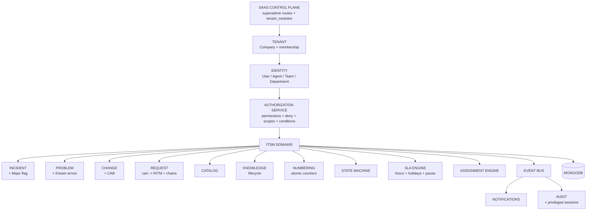

# PLATFORM 01 — ITSM / HELPDESK (single source of truth)

Status legend: `IMPLEMENTED` (code evidence below) · `PARTIAL` (works with known gaps) ·
`BACKEND_ONLY` · `FRONTEND_ONLY` · `MISSING`. Source of truth priority: executable
code > schema > API wiring > frontend > tests > this document.

Generated from the repository on 2026-09-03. Evidence paths are backend-relative
unless prefixed `FE:` (OsTicketFrontend).

---

## PART A — SaaS Platform Foundation

### A1. SaaS control plane
| Capability | Status | Evidence |
|---|---|---|
| Tenant lifecycle (create/read/update/activate/suspend/archive/restore/terminate) | IMPLEMENTED | `src/routes/superadmin.routes.js` (`/companies/*`), `src/controllers/superadmin/` |
| Plans, subscriptions, module entitlements, usage limits | IMPLEMENTED | `src/models/Plan.js`, `Entitlement.js`, `UsageLimit.js`, `tenant_modules` collection |
| Module activation/deactivation + trial/grace | IMPLEMENTED | `src/middleware/module.js` (`moduleRequired`, `activateModules`, grace read-only) |
| Module whitelist (21 keys incl. cmdb/secops/grc/workplace/legal/procurement/finance/esg/fsm) | IMPLEMENTED | `src/middleware/module.js` |
| SaaS operators, audit, operations/health, billing controls | PARTIAL | superadmin routes + `AuditLog.js`; per-operator permission scoping is coarse |
| Tenant data protected from SaaS operators by default | PARTIAL | boundary is conventional (separate tokens/planes); privileged access is session-based (see A3) but per-action dual-actor logging is not enforced in every controller |

### A2. SaaS roles & permissions
SaaS operator permissions are string grants on `SuperAdmin.permissions`, checked by
`requireSuperAdminPermission` (`src/middleware/auth.js`). Tenant roles use `Role`
(`src/models/Role.js`): `scope` platform|tenant with boundary validation,
`category`, `permissions[]` (30-key enum, see F2), `deniedPermissions[]` (explicit
DENY, no enum by design), `recordScopes[]`, `fieldAccess[]`, `moduleKeys[]`,
`approvalLimit`, `protected`, `assignableBy`.

### A3. Privileged access (MD §8)
| Capability | Status | Evidence |
|---|---|---|
| Impersonation requires reason, short-lived token (15m default, 60m max) | IMPLEMENTED | `src/controllers/superadmin/impersonation.js`, `POST /superadmin/impersonate` |
| Session record: sessionId, real/effective actor, tenant, reason, expiry, IP/UA, correlationId, termination | IMPLEMENTED | `src/models/PrivilegedSession.js` |
| Revocation enforced at auth time (`sid` claim check in `protectAgent`) | IMPLEMENTED | `src/middleware/auth.js` |
| Break-glass with self-approval flag, audit + operator notification | IMPLEMENTED | `POST /superadmin/break-glass` |
| Session list / revoke endpoints | IMPLEMENTED | `GET /superadmin/privileged-sessions`, `POST /superadmin/privileged-sessions/:id/revoke` |
| Per-action dual-actor (`realActorId` + `effectiveActorId`) stamping in ITSM writes | MISSING | session carries both actors; controllers do not stamp them yet |

---

## PART B — Tenant Administration & RBAC

### B1. Central authorization service (MD §26/§59/§85)
`src/services/authorization.service.js` — `authorize({principal, permission,
tenant, module, resource, record, requiredScope, conditions, fields, req})`.
Chain: authenticated → account active → tenant resolved → membership valid →
module entitlement → permission (DENY > direct > role > assignment > default deny)
→ scope gate → record conditions → advisory field filtering. Internal `reason`
codes are audited (`authz.denied`), never sent to clients; `assertPermission()`
throws generic 403. `requirePermission(perm, opts)` middleware delegates to it and
attaches `req.authz`. Legacy `hasPerm`/`isAdminAgent` (`agent.controller.js`) and
`rbac.effectiveAccess` delegate to the same precedence (incl. role DENY).

Scopes evaluated: `TENANT, OWN, ASSIGNED_TO_ME, TEAM, DEPARTMENT`
(+ legacy lowercase `recordScopes` mapping). Record conditions support
`=,!=,in,not_in` with `current_user/current_tenant` tokens.

### B2. RBAC gap register
| Capability | Status | Notes |
|---|---|---|
| Custom roles / custom permissions engine | MISSING | no CustomRole/CustomPermission models; tenant roles are admin-curated `Role` docs |
| Tenant permission-namespace (`tenant.*`, `itsm.*`) | MISSING | current keys are flat (`tickets.view`, …); rename is a migration |
| Permission simulation / "what can user X do" | MISSING | |
| Temporary roles / delegation approval workflow | PARTIAL | `platformSecurity/Delegation.js` (scopes/reason/expiry); no approval flow or engine hookup |
| Separation-of-duties rules | MISSING | `canGrant` blocks platform/protected + unheld-perm grants only |
| Frontend action/field gating | PARTIAL | route-level `ModuleGuard` + new per-action gates (escalations, CAB); no field-level gating |

---

## PART C — ITSM Modules (status vs evidence)

| ID | Module | Status | Backend evidence | Frontend evidence (`FE:helpdesk/pages/`) |
|---|---|---|---|---|
| ITSM-01 | Service Desk / tickets | PARTIAL | `ticket.routes.js`, `agent.routes.js` (reply/note/assign/claim/transfer/status/merge/split/tasks/SLA pause), `Ticket.js` | TicketList, NewTicket, TicketDetail (+tasks/SLA/closure), TicketBoard, TicketTemplates, TicketCrud, MyWork |
| ITSM-02 | Incident | PARTIAL | `Enterprise Incident.js` (Sev1-4, commander, timeline), `GET/POST/PUT /enterprise/incidents` with numbering + state machine | Incidents, IncidentCrud, IncidentDiagnosis, IncidentPlaybooks |
| ITSM-03 | Major incident | PARTIAL | `isMajor` flag, comm-plan + exec-report endpoints (`gaps2`) | MajorIncidents, WarRoom, OutageTracking, OnCallSchedules |
| ITSM-04 | Problem | PARTIAL | `Problem.js` (RCA/workaround/known_error/permanentSolution, links), `GET/POST/PUT /enterprise/problems`, publish-KB + gen-change | Problems, ProblemCrud, KnownErrors |
| ITSM-05 | Change | PARTIAL | `Change.js`, `GET/POST/PUT /enterprise/changes`, blackout windows, CAB decide via status matrix | Changes, ChangeCrud, ChangeCalendarPage, CabBoard, PostImplReviews |
| ITSM-06/07 | Request / Catalog | PARTIAL | cart→RITM checkout, bundles, eligibility, approval-chains (`gaps2`) | Requests, ServiceCatalog |
| ITSM-08 | Knowledge | PARTIAL | `Faq.js` lifecycle (draft/review/approved/published/expired/archived) + `POST /agent/faqs/:id/transition`, gap analysis, publish-sweep | KnowledgeBase (lifecycle toolbar), KnowledgeInsights |
| ITSM-09 | SLA | PARTIAL | `SlaPlan.js` (targets, pause, per-plan businessHours/timezone), global hours+holidays engine, OLA breach radar | SlaMonitor, PriorityMatrixEditor, Settings/SLA |
| ITSM-10 | Assignment & routing | PARTIAL | next-agent engine (round-robin/skills/least-loaded), caps, assignment history, workload | AssignmentRouting, ShiftHandover |
| ITSM-11 | Tasks | PARTIAL | ticket tasks CRUD; closure codes; worklogs; trash/restore | in TicketDetail; HelpdeskAdmin (trash) |
| ITSM-12 | Approvals | PARTIAL | `Approval.js`, approval-chains + decide, my-approvals inbox | Requests (chains), ApprovalInbox (settings), CabBoard (gated) |
| ITSM-13 | Escalations | IMPLEMENTED | `GET/POST/PUT/DELETE /agent/escalations` + `escalations.manage` enforcement | Escalations (permission-gated) |
| ITSM-14 | Comms & notifications | PARTIAL | threads, mentions extract, presence, email/chat/in-app, quiet hours service | in TicketDetail; NotificationPrefs (settings) |
| ITSM-15 | Workspace | PARTIAL | queues, saved queues, workload, canned | MyWork, TicketBoard |
| ITSM-16 | Self-service portal | PARTIAL | portal login/register, open-form, public catalog/chat/status/CSAT | CustomerServicePortal (CSM), NewTicket |
| ITSM-17 | Satisfaction | PARTIAL | `Survey.js`, `SurveyResponse.js`, public CSAT submit/lookup, negative-recovery sweep | CsatDashboard |
| ITSM-18 | Reporting | PARTIAL | reports/overview, realtime, MTT metrics, exec major-incident report | HelpdeskReports, analytics/* |
| ITSM-19 | Administration | PARTIAL | help-topics, SLA plans, canned, announcements, filters, closure codes, custom statuses/forms/tables | HelpdeskAdmin, PriorityMatrixEditor, Settings/* |
| ITSM-20 | Audit & history | PARTIAL | `AuditEvent.js`/`AuditLog.js`, audit.service, `/enterprise/audit`, privileged session audit | AuditTrail, Settings/AuditLogs |

Cross-cutting engines: `numbering.service.js` (atomic per-tenant INC/PRB/CHG/REQ/RITM/TASK;
legacy tickets keep the unique random generator), `stateMachine.service.js`
(ticket/incident/problem/change/faq matrices, enforced in `changeStatus`,
enterprise PUTs, FAQ transitions), `authorization.service.js` (above).

---

## PART D — Backend Architecture

Layered flow: `routes/` → `middleware/auth.js` (authenticate) → `middleware/module.js`
(entitlement) → `requirePermission` (authorize) → `controllers/` →
`services/` (domain) → `models/` → MongoDB; side-effects via `services/events.js`
→ audit / notifications / SLA / search. Tenant isolation: `company` scoping +
`tenantScope` (`runWithTenant`) + `scopeTicketQuery` record scoping; mass
assignment removed from enterprise ITSM PUTs (whitelisted fields).

---

## PART E — Verification & Tests

| Test | Type | Covers |
|---|---|---|
| `tests/authorization.test.js` (26 asserts) | unit, no DB | gates, deny precedence, scopes, conditions, fields, modules, generic 403 |
| `tests/itsm-foundation.test.js` (25 asserts) | unit, no DB | numbering format, 5 state matrices, SLA calendar, role deny |
| `tests/tenant-isolation.test.js`, `platform-role-boundary`, `organization-hierarchy`, `itsm-ticket-*`, `helpdesk-agent-contract` | integration, needs Mongo | end-to-end (run against isolated DB, never shared Atlas) |

Negative-path evidence: authorization unit tests assert DENY for unauthenticated,
inactive, tenant-less, cross-tenant, permission-missing, scope-rejected and
condition-rejected cases. HTTP-level negative tests (403 + cross-tenant) exist in
the integration suite but require an isolated MongoDB to execute.

---

## PART F — Matrices (condensed; full row-level matrices are generated from code)

### F1. Role matrix (representative)
| Role | Layer | Scope source | Purpose | Status |
|---|---|---|---|---|
| SAAS_SUPER_ADMIN | SAAS | platform aggregate | platform ops, tenants, plans | PARTIAL (coarse per-operator perms) |
| Tenant Admin (`isAdmin`) | TENANT | `admin_aggregate` via authz service | full tenant access, audited | IMPLEMENTED |
| Agent (role-based) | TENANT | `Role.permissions` + `recordScopes` + `deniedPermissions` | scoped ITSM work | IMPLEMENTED |
| Requester/User | TENANT | own-record scoping | portal self-service | IMPLEMENTED |
| Custom roles | TENANT | — | tenant-defined | MISSING |

### F2. Permission matrix (from `Role.PERMISSIONS`, 30 keys)
`tickets.view/create/edit/assign/transfer/close/delete/reply/note/tasks`,
`users.manage`, `kb.manage`, `canned.manage`, `admin.manage`, `orgs.manage`,
`escalations.manage`, `organization.manage`, `organization.units.manage`,
`organization.locations.manage`, `access.manage`, `roles.manage`,
`modules.manage`, `billing.view/manage`, `workflow.manage`,
`integrations.manage`, `reports.manage`, `data.manage`, `audit.view`,
`approvals.decide`, `records.view/create/update/delete`, `exports.create`,
`security.manage` — all BACKEND-enforceable via the service; route wiring is
incremental (escalation writes enforced; ticket reads scoped; remainder open).
`itsm.*`/`tenant.*`/`saas.*` namespaced keys: MISSING (migration).

### F3. API → permission matrix (helpdesk surface)
| Method + Endpoint | Permission / gate | Status |
|---|---|---|
| `GET /agent/tickets`, `:number`, reply/note/assign/claim/transfer/tasks | module `helpdesk` + record scoping (`scopeTicketQuery`) | PARTIAL (no per-action perm yet) |
| `POST /agent/tickets/:n/status` | module + status allow-list + state machine | PARTIAL |
| `POST/PUT/DELETE /agent/escalations` | `escalations.manage` via central service | IMPLEMENTED |
| `GET/POST/PUT /enterprise/incidents|problems|changes` | module + company isolation + numbering + state machine | PARTIAL (no per-action perm yet) |
| `POST /agent/faqs/:id/transition` | `kb.manage` + faq matrix | IMPLEMENTED |
| `POST /superadmin/impersonate|break-glass`, session revoke | superadmin + reason + session TTL | IMPLEMENTED |
| `POST /gaps2/catalog/cart`, approval-chain decide | module + quota/eligibility/step rules | PARTIAL |

### F4. Custom-permission matrix
| Capability | Status |
|---|---|
| create/edit/disable/delete custom permission, custom scope/condition/field | MISSING (engine does not exist) |
| role-level DENY, direct `!` DENY, precedence | IMPLEMENTED |
| temporary/delegated access with expiry | PARTIAL (Delegation model only) |

---

## PART G — Roadmap (next dependencies in order)

1. Per-action `requirePermission` rollout: tickets (view→`tickets.view`, assign→`tickets.assign`, close→`tickets.close`, …), incidents/problems/changes — each with authorized + unauthorized + cross-tenant HTTP tests on isolated Mongo.
2. Custom roles/permissions engine (tenant namespace, escalation guards, simulation).
3. Per-action dual-actor stamping for privileged sessions in ITSM writes.
4. `itsm.*`/`tenant.*`/`saas.*` permission rename migration.
5. Request fulfilment-task chain + change/problem task sub-entities in UI.
6. Calendar-aware breach evaluation wired into OLA radar + scheduled SLA job evidence.
7. Survey trigger/template engine (on-close CSAT).
8. Mobile (`GaliocasNetwork`) parity for workspace/CAB/SLA/escalation flows.
9. Full row-level matrices (role×permission, feature hierarchy) extracted from verified code.

Acceptance for any item: authorized 200 + unauthorized 403 + cross-tenant 403/404 +
audit event + docs row updated here. Platform 01 is complete only when every P0/P1
row above reads IMPLEMENTED with test evidence.
